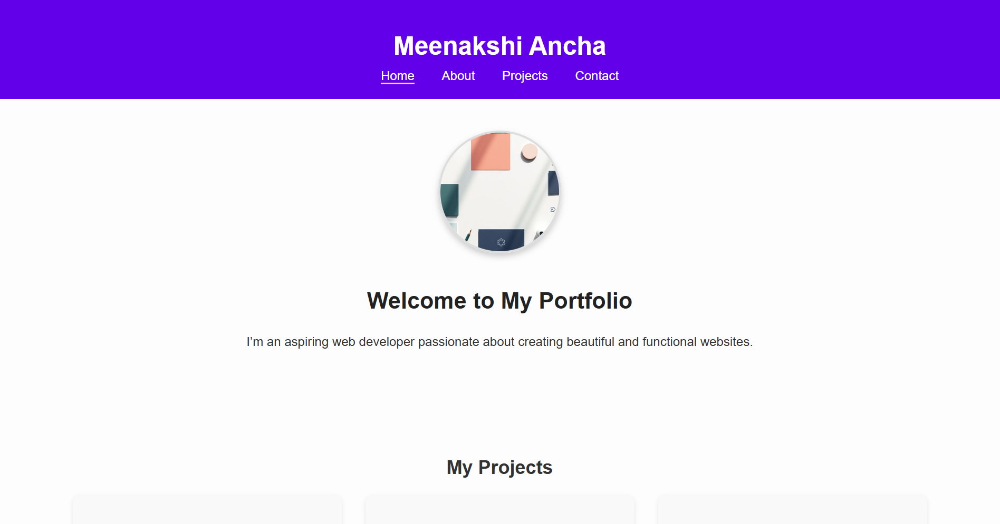
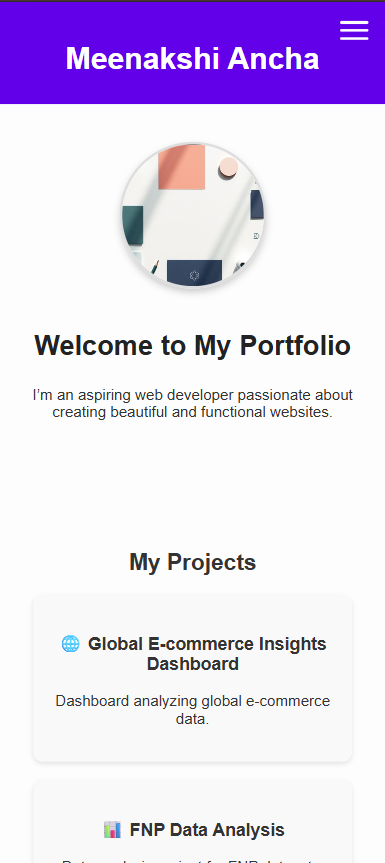

# Meenakshi Ancha — Portfolio 
# Meenakshi Ancha — Portfolio
(Add final polished README.md)

**Live Demo:** [https://meenakshi3357.github.io/my-portfolio/](https://meenakshi3357.github.io/my-portfolio/)

## Overview
This is my personal portfolio website showcasing my projects, skills, and contact information.  
Built using **HTML**, **CSS**, and **JavaScript**, it is fully responsive across desktop, tablet, and mobile devices.

## Features
- Responsive **About Me** section (image + text)  
- Responsive **Projects** section with project cards  
- Functional **Contact Form** (frontend only)  
- Mobile-friendly **navigation** with hamburger menu  
- Clean, modern, and responsive design using **Flexbox** and **Media Queries**

## Tech Stack
- **HTML5**  
- **CSS3** (Flexbox, Media Queries)  
- **JavaScript** (for navbar toggle)

## How to Run Locally
To view or edit this project on your own computer:

```bash
# 1️⃣ Clone the repository
git clone https://github.com/meenakshi3357/my-portfolio.git

# 2️⃣ Move into the folder
cd my-portfolio

# 3️⃣ Open in browser
Open index.html in your web browser

## Screenshots

**Desktop View:**  


**Mobile View:**  



